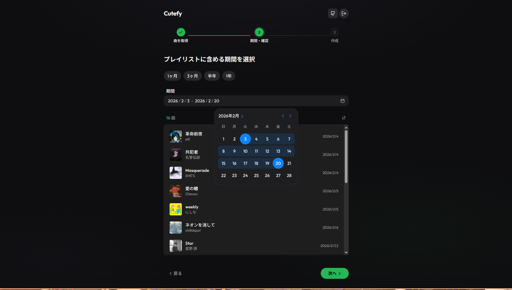

# Cutefy

Spotify のお気に入り曲を期間で絞り込んで、サクッとプレイリストを作成できる Web アプリ。



## Features

- **Spotify ログイン** — OAuth でワンクリック認証
- **お気に入り曲の読み込み** — ライブラリに保存した全楽曲を取得
- **日付フィルタリング** — 追加日の期間指定で楽曲を絞り込み（今週・今月などのプリセット付き）
- **プレイリスト作成** — フィルタした楽曲から Spotify プレイリストを自動生成

## Tech Stack

- **Next.js 16** (App Router) / React 19 / Tailwind CSS v4
- **UI**: HeroUI v3 beta + Lucide icons
- **認証**: better-auth (Spotify OAuth)
- **Spotify API**: @spotify/web-api-ts-sdk
- **Deploy**: Cloudflare Workers (OpenNext)

## 必要なもの

- [mise](https://mise.jdx.dev/)（Node.js・pnpm のバージョン管理）
- [Spotify Developer](https://developer.spotify.com/) アカウント
- [Cloudflare](https://www.cloudflare.com/) アカウント（デプロイする場合）

## セットアップ

### 1. ツールのインストール

```bash
mise trust
mise install
```

これで `mise.toml` に定義された Node.js 24 と pnpm 10 がインストールされます。

### 2. Spotify App の作成

1. [Spotify Developer Dashboard](https://developer.spotify.com/dashboard) にアクセス
2. 「Create App」をクリック
3. 以下を設定:
   - **App name**: 任意（例: `Cutefy`）
   - **Redirect URIs**: `http://127.0.0.1:3000/api/auth/callback/spotify`（ローカル開発用）
   - **APIs used**: Web API にチェック
4. 作成後、Settings から **Client ID** と **Client Secret** を控える

### 3. 環境変数の設定

```bash
cp .env.example .env
```

`.env` を編集:

```env
NEXT_PUBLIC_APP_URL=http://127.0.0.1:3000
BETTER_AUTH_URL=http://127.0.0.1:3000
BETTER_AUTH_SECRET=<ランダムな文字列（openssl rand -base64 32 で生成）>
NEXT_PUBLIC_SPOTIFY_CLIENT_ID=<Spotify Client ID>
SPOTIFY_CLIENT_SECRET=<Spotify ClientClient Secret>
```

### 4. ローカル開発

```bash
pnpm install
pnpm dev
```

http://127.0.0.1:3000 でアクセスできます。

## Cloudflare Workers へのデプロイ

### 1. Wrangler の認証

```bash
pnpm wrangler login
```

### 2. wrangler.jsonc の編集

`wrangler.jsonc` の `vars` を自分の環境に合わせて変更:

```jsonc
{
  "vars": {
    "NEXT_PUBLIC_APP_URL": "https://<your-worker>.workers.dev",
    "NEXT_PUBLIC_SPOTIFY_CLIENT_ID": "<Spotify Client ID>",
    "BETTER_AUTH_URL": "https://<your-worker>.workers.dev"
  }
}
```

### 3. シークレットの設定

サーバー側の秘匿情報は Wrangler の secrets で管理します:

```bash
pnpm wrangler secret put BETTER_AUTH_SECRET
pnpm wrangler secret put SPOTIFY_CLIENT_SECRET
```

### 4. Spotify Redirect URI の追加

[Spotify Developer Dashboard](https://developer.spotify.com/dashboard) で、デプロイ先の Redirect URI を追加:

```
https://<your-worker>.workers.dev/api/auth/callback/spotify
```

### 5. デプロイ

```bash
pnpm cf:deploy
```

## 注意事項

Spotify API は「Development Mode」の制限により、アプリ作成者が [Spotify Developer Dashboard](https://developer.spotify.com/dashboard) で明示的に登録したユーザーのみログインできます。そのため、公開されているデプロイ先に第三者がアクセスしてもログインはできません。自分用に使う場合は、上記のセットアップ手順に従って自身の Spotify App を作成してください。

## License

MIT
